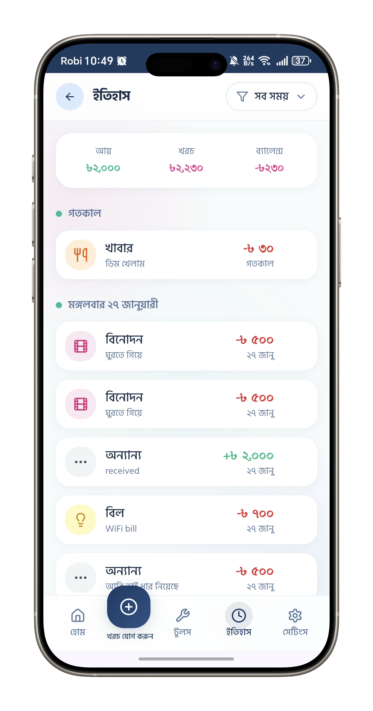
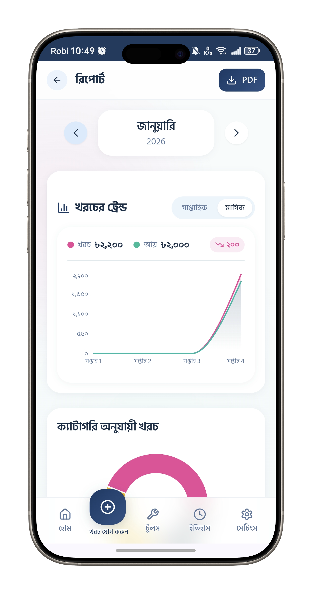
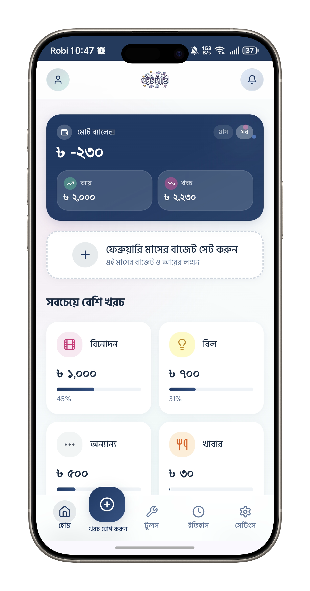
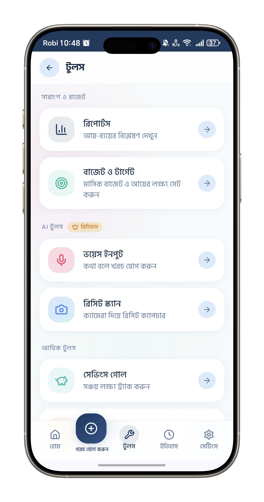
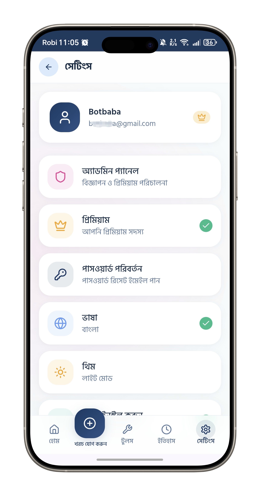

   
  
  

  # Amader Khorchapati
  ### The AI-Powered Smart Personal Finance & Expense Tracker for Bangladesh

  
  
  

---

## 🚀 Overview
**Amader Khorchapati (আমাদের খরচাপাতি)** is an AI-powered personal expense tracking app that helps you easily record your daily income and expenses, control your budget, and grow your savings. It features a fully Bangla interface, typography-focused design, and a multi-platform (Web + PWA + Mobile-like) smart finance management solution.

*A simple, fast, secure, and smart all-in-one app to manage your money efficiently.*

**আমাদের খরচাপাতি** হলো একটি AI-Powered ব্যক্তিগত খরচ ট্র্যাকিং অ্যাপ, যার মাধ্যমে আপনি সহজেই আপনার দৈনন্দিন আয়–ব্যয়ের হিসাব রাখতে, বাজেট নিয়ন্ত্রণ করতে এবং সেভিংস বাড়াতে পারবেন। এটি একটি সম্পূর্ণ বাংলা ইন্টারফেস, টাইপোগ্রাফি-ফোকাসড, এবং মাল্টি-প্লাটফর্ম (Web + PWA + Mobile-like) স্মার্ট ফাইন্যান্স ম্যানেজমেন্ট সলিউশন!

*সহজ, দ্রুত, নিরাপদ এবং স্মার্ট উপায়ে আপনার টাকা ব্যবস্থাপনার জন্য একটি অল-ইন-ওয়ান অ্যাপ!*

---

## 🔗 Quick Links
| Platform | Link | Action |
| :--- | :--- | :--- |
| **🌐 Website** | [amaderkhorchapati.xyz](https://amaderkhorchapati.xyz) | **Visit Official Site** |
| **📱 Web App** | [web.amaderkhorchapati.xyz](https://web.amaderkhorchapati.xyz) | **Login / Use Online** |
| **🤖 Android** | [Download APK](./apk/app-release.apk) | **Download v1.0** |

---

## 📸 App Screenshots
Here is a complete tour of the **Amader Khorchapati** user interface:

| Expense History | Visual Reports |
| :---: | :---: |
|  |  |
| *Filter history by day, month or year* | *Spending analysis charts* |

| Dashboard & Home | Add Expense |
| :---: | :---: |
|  |  |
| *Intuitive Dashboard showing balance* | *Quickly add daily expenses* |

| More Tools (Zakat, Loan, Savings) | Menu & Settings |
| :---: | :---: |
|  |  |
| *Zakat Calculator, Debt Manager & Goals* | *Profile & App Customization* |
---

## ✨ Core Features (মূল ফিচারসমূহ)

### 💰 Smart Tracking & Analytics
- **Income/Expense:** Track daily transactions with 10+ categories (Food, Transport, Salary, etc.).
- **Interactive Dashboard:** Toggle between "This Month" & "Total" views with real-time balance.
- **Visual Reports:** Understand spending habits with **Pie Charts** and **Trend Lines**.
- **Notes & Grouping:** Organize transactions by date with detailed notes.

### 🎯 Planning & Goals
- **Budget Management:** Set monthly limits and get notifications when you overspend.
- **Savings Goals (সেভিংস গোল):** Set targets (e.g., Buy Phone) with progress bars and custom icons.
- **Debt Manager (ঋণ ট্র্যাকার):** Track "Given" (পাওনা) and "Taken" (দেনা) loans with partial payment history.

### 🕌 Islamic Finance Tools
- **Zakat Calculator:** Automated 2.5% calculation based on Nisab.
- **Asset Input:** Calculate based on current Gold/Silver market prices.

---

## 🤖 Premium AI Features
Unlock the power of **Google Gemini AI** to automate your finance:

- **🎤 Voice Input (Bangla):** Just speak simply (e.g., "Lunch 200 taka") and AI will auto-detect category and amount.
- **📷 Receipt Scanner:** Snap a photo of any receipt, and the AI will extract the data instantly.

---

## 📲 PWA & User Experience
- **Native Experience:** Install on Home Screen (Android & iOS Safari).
- **Quick Shortcuts:** Long-press icon for fast Add Expense/Income.
- **Bilingual:** Full support for **Bangla (SolaimanLipi)** and **English**.
- **Dark Mode:** System-adaptive Light and Dark themes.
- **Secure:** 100% Secure Cloud Storage with Supabase.

---

## 🛠 Tech Stack
This project is built using modern web and hybrid technologies:
| Layer | Technology |
| :--- | :--- |
| **Frontend** | React, HTML5, CSS3, JavaScript (PWA) |
| **Styling** | Tailwind CSS, Framer Motion |
| **Backend** | PHP, Laravel Framework |
| **Database** | MySQL |
| **Server** | Linux (Ubuntu)|
| **PWA** | React PWA |
| **Android Wrapper** | WebView / Hybrid Support |

---

## 👨‍💻 Developer & Company Info

### Developed by **XenoCloud IT**
*Innovating Web, App, & Cloud Solutions.*

**Amader Khorchapati** is the flagship product of **XenoCloud IT**, designed and developed by **Nahid Shahareyar Setu**.

- **Company Website:** [xenocloudit.com](https://xenocloudit.com)
- **Lead Developer:** [Nahid Shahareyar Setu](https://iamsetu.xyz)
- **GitHub:** [@SETUxyz](https://github.com/SETUxyz)
- **Portfolio:** [iamsetu.xyz](https://iamsetu.xyz)
- **Company Services:** Web Development, App Development, Cloud Solutions, Bot Automation.
- **Contact:** [support@xenocloudit.com](mailto:support@xenocloudit.com)

---

## 📄 License & Privacy
This project is proprietary software developed by **XenoCloud IT**.
For privacy policy details, please visit: [amaderkhorchapati.xyz/privacy](https://amaderkhorchapati.xyz)

---

  <i>© 2026 আমাদের খরচাপাতি (Amader Khorchapati) by XenoCloud IT. All rights reserved.</i>

